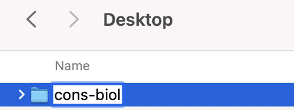

# Getting started and Learning R {-}

If you have not used `R` previously, you may wish to work through Chapters 1 to 10 of the [Quantitative training guide](https://ahurford.github.io/quant-guide-all-courses/), which includes instructions on how to install `R` on a computer.

## To hand-in {-}
**EVAN:** We should give the students some guidance on what they are to hand-in. Usually we might ask for a working R Script, because if just the figures are required the students can take screenshots.

# How to do the analysis in R {-}

## Data importation and filtering {-}

Let's explore the _protected areas_ data from the World Database on Protected Areas.

1.  It is best to make a folder on your computer Desktop where you will work on this assignment (if needed, review [Best Practices](https://ahurford.github.io/quant-guide-all-courses/style.html)).

```{r,out.width="40%",echo=F}

```

2.  Download the `.csv` file spreadsheet for protected areas in the country you are studying from the _World Database on Protected Areas_ to the folder you made. You may rename the `.csv` file you downloaded eg. `protected_areas.csv`

3.  [Open and save a new R Script](https://ahurford.github.io/quant-guide-all-courses/rstudio.html#source-pane%5D) in your folder. One of the first commands of your R Script will be to [load your data](https://ahurford.github.io/quant-guide-all-courses/data-entry.html#loading-or-importing-data). For example:

```{r,results=FALSE}
data1 <- read.csv(file = "protected_areas.csv")
```

When writing your R script you need to learn about using your `Console` versus writing your R Script in the Source pane. Please read the section [Finding your way around R Studio](https://ahurford.github.io/quant-guide-all-courses/rstudio.html) if this is unfamiliar.

When you find a command that is essential to your analysis, you should put it in your R Script. Note that the order of the commands is important: the will run top to bottom. If you just want to test out a command, then use your `Console`. After you find a command that works (by testing in the `Console`), you might want to add it to your R Script. To run all the commands in your R Script (line by line) you use the `Source` button (or find Source from the Code menu), or you highlight the lines to run and use the `Run` button.

4.  In the [Console](https://ahurford.github.io/quant-guide-all-courses/rstudio.html#console-pane), inspect your data to check that it has loaded. For example:

```{r, results=FALSE}
head(data1)
```

We put this command in the `Console` because it is just to check that the data loaded correctly. It isn't necesssary to have this command in our R Script, however, the `read.csv()` command from above is essential, so you definitely want that one amongst the first few lines of your R Script. After you add a few lines to your R Script, you will want to periodically run your whole R script to make sure it is working as you expect.

If your data has not loaded, the most likely problem is a spelling error or problems with specifying the [path](https://ahurford.github.io/quant-guide-all-courses/rintro.html#working-directory) to `protected_areas.csv`. You might try:

-   the [RStudio way](https://ahurford.github.io/quant-guide-all-courses/data-entry.html#the-rstudio-way-the-import-feature) of importing your data, or

-   moving `protected_areas.csv` to your [working directory](https://ahurford.github.io/quant-guide-all-courses/rintro.html#working-directory). The working directory is the folder you created to contain your data and files. 

5.  After loading the data, read through the metadata file that is downloaded as a pdf file along with the `.csv` file to better understand the data.

> **Data and metadata can be found here**

> <https://www.protectedplanet.net/en/search-areas?geo_type=site>

6.  You will want to do some exploration of your data. See [Handling the data](https://ahurford.github.io/quant-guide-all-courses/handling-data.html) for how to recover the names of the columns for all the data.

```{r}
names(data1)
```

Note that `names(data1)` is a good command to run in the `Console` because we want to know the column names so that we can extract the correct column later: `names(data1)` would be run in the `Console` because it is a query rather than an essential part of the analysis.

7. You could also use the `summary()` function to run a quick statistical summary of the data frame, calculating mean, median and quartile values for continuous variables. Try this in the `Console`:

```{r,results=FALSE}
summary(data1)
```

Again, `summary(data1)` is a query - to check that our data looks okay, so we opt to run it in the `Console` rather than adding it to our R Script.

8. To extract a column of the data, see [Handling the data](https://ahurford.github.io/quant-guide-all-courses/handling-data.html). You may use either Approach 1: `dplyr` or Approach 2: base R. Generally, the `dplyr` commands tend to be simpler, however, it is good to also know the base R commands. You need only choose 1 approach. We recommend Approach 1: `dplyr`, unless you have prior experience with base R and prefer to do the analysis that way.

**Approach 1: dplyr**

If you have not installed the `dplyr` package you will need to install it. Please read [install](https://ahurford.github.io/quant-guide-all-courses/rintro.html#r-packages). 

Once it is installed, to use the [`dplyr` functions](https://ahurford.github.io/quant-guide-all-courses/handling-data.html#dplyr) you need to load the package:

```{r,message=F}
library(dplyr)
```

This command is essential, and generally we would put it as one of the first commands in our R Script.

Now we select the `MARINE` column, with the command:

```{r, results = F}
select(data1, MARINE)
```

The output of `select(data1, MARINE)` is a data frame because the variable has an associated name.

**Approach 2: Base R**

To view the `MARINE`, column of the data in the `Console`, try:

```{r, results=FALSE}
data1$MARINE
```

Be sure to type exactly `MARINE` after the `$`.

You need to write the column name exactly as it appears in the output of `names(data1)` or RStudio will produce an error. Remember `MARINE` is capitalized in the data frame so be careful not to type `Marine` which will come out as an error. 

## Creating a new object {-}
This section is focused on subsetting the data that was named `data1` and creating a new object to hold the processed data. We will call this `data2`.

1. We want to filter the data to separate protected areas identified as exclusively terrestrial from those that include marine areas. The new data created will be saved as `data2`. Let's run this code in the `Console`:

**Approach 1: dplyr**

```{r, results=F}
data2 <- filter(data1, MARINE != 0)
```

**Approach 2: base R**
```{r, results=F}
data2 <- data1[data1$MARINE!=0,]
```

Note, the comma inside the square brackets indicates to take all columns for the rows where `MARINE!=0` is `TRUE`.

**Both approaches**

In the `MARINE` column `0` indicates that a site is not marine. The new variable `data2` now contains all the rows for the marine sites because `!=0` means the value is not 0, and so therefore the site *is* marine (a double negative!).

Check your output:

```{r, results=F}
head(data2)
head(data2$MARINE)
```

In particular, look at the `MARINE` column. Are there any `0`s left in the `MARINE` column? No? Good, because we want the marine sites, so we do not want any `0`s in the `MARINE` column.

2. We want to compute the average size of coastal MPAs. Let's take a look at the value of `GIS_M_AREA` in row 18041:

```{r}
data2$GIS_M_AREA[18041]
```

Oh no! The value of the column `GIS_M_AREA` for this row of data is `NA`. This means that no value was recorded. This will ruin our calculation of the average so we need to remove these `NA` values from the `GIS_M_AREA` column.

Which rows are `NA`s? We can find out like this:

```{r}
head(which(is.na(data2$GIS_M_AREA)=="TRUE"))
length(which(is.na(data2$GIS_M_AREA)=="TRUE"))
```

where `head()` is used to return only the first 6 rows with NA values so as to not return a lengthy output, and `length()` is used to tell us there are 497 `NA` values in the `GIS_M_AREA` column.

**Approach 1: dyplyr**
Here is the command to remove the `NA`s as described in [Handling the data](https://ahurford.github.io/quant-guide-all-courses/handling-data.html#dplyr):

```{r, results=F}
data3 <- filter(data2, !is.na(GIS_M_AREA))
```

The above line of code is more than a query, it is an essential step in the analysis so you will want to add it to the code in your R script in the `Source` pane.

**Approach 2: base R**
To remove the `NA`s

```{r}
data3 <- data2[!is.na(data2$GIS_M_AREA),]
```

**Both approaches**

Let's check that we effectively removed the `NA`s from the data.

```{r, results=F}
head(which(is.na(data3$GIS_M_AREA)=="TRUE"))
length(which(is.na(data3$GIS_M_AREA)=="TRUE"))
```
Now we see that `data3` is a cleaned up version of `data2` that no longer contains the the `NA` values in the `GIS_M_AREA` column because when we use `length()` to find out how many of the values in `data3$GIS_M_AREA` are `NA` and the returned value is 0.

The commands above are a query so you would run them in the `Console` to check that your analysis is going to plan, however, you do not need to include this in your R Script.

3. We can now calculate the average size of the coastal MPAs. Let's run this code:

```{r, results=F}
mean(data3$GIS_M_AREA)
```

4. The median size of the coastal MPAs can also be found by running a similar code as follows:
```{r, results=F}
median(data3$GIS_M_AREA)
```

## Preparing the data for graphing{-}

Before, we can make the graphs we will need to organize the data we want to graph.

1. First, we would like to graph the number of areas in each level of protection. To do this, we will have to group the data according to the level of protection and count the number of areas in each level of protection and saving it as `data4`.

**Approach 1: dplyr**

```{r, results=F}
data4 <- data3 %>%
  group_by(IUCN_CAT) %>%
  tally()
```

**Approch 2: base R**

```{r, results=F}
data4 <- aggregate(cbind(n = IUCN_CAT) ~ IUCN_CAT, 
          data = data3, 
          FUN = function(x){NROW(x)})
```

**Both approaches**

Let's query the result in our `Console` to see that this worked:

```{r}
data4
```

Yikes! Rows 6, 7, and 8 are `Not Applicable`, `Not Assigned` and `Not Reported`. We need to remove these.

We delete the rows that have `NAs` by running this:

```{r, results=F}
data4 <- data4[-c(6, 7, 8), ] 
```

Note that the minus sign indicates to remove.

Our data describing the number of areas in each level of protection is now ready as `data4`, but let's clean more data to make another graph before moving on to the graphing section.

2. Now we would like to calculate the amount of area that is strongly protected.

**Approach 1: dplyr**
We can do this by grouping by the `IUCN_CAT` column of the dataset and summing the `GIS_M_AREA` accordingly and naming the resulting data as `data5`. Let's run this code in the `Console`:

```{r, results=F}
data5 <- data3 %>% 
  group_by(IUCN_CAT) %>% 
  summarise(AREA_SUM = sum(GIS_M_AREA))
```

**Approach 2: base R**
```{r, eval=F}
data5 <- aggregate(GIS_M_AREA ~ IUCN_CAT, data3, sum)
```

**Both approaches**

We can check the result by typing, in the Console:

```{r}
data5
```

Note that this time, we would like to leave the categories: `Not applicable`, `Not assigned` and `Not reported` (**Evan is this right???)**. If `data5` looks good, you will want to add the commands that produced `data5` to your R script in the Source window.

## Making graphs{-}

In this section we will made graphs of `data4` and `data5`. You can read more on [Making graphs in R](https://ahurford.github.io/quant-guide-all-courses/graph.html).

1. We would like to construct a histogram to graph the size-frequency distribution. 

We will construct a histogram without logarithm scale with the function `hist()`. The data we need to use are `data3$GIS_M_AREA` which contains the areas of the marine protected areas:

```{r}
hist(data3$GIS_M_AREA, breaks = 50,
     xlab = "Size of MPAs",
     ylab="Frequency",
     main = "The size-frequency distribution of MPAs")   # Histogram without logarithmic axis
```

We can plot these results on a logarithm scale as:

```{r}
hist(log(data3$GIS_M_AREA), breaks = 50, xlab = "log of the size of MPAs", ylab = "Frequency")   # Histogram with logarithmic axis
```

We can use a barplot to show the number of areas under each level of protection from the data contained in `data4`. Remember that `data4` has two columns:

```{r}
data4
```

The values of interest are in the column named `n`, which are the numbers associated with each level of protection. We refer to just this column using the command `data4$n`. Use the following code to make the bar plot:

```{r, results=F}
barplot(data4$n,
        xlab = "Level of protection",
        ylab="Number of areas",
        names.arg=c("Ia","Ib","II","III","IV","V","VI"),
        las=1,
        main="Number of areas for each level of protection")
```

Let's revisits the data we saved in `data5`.

```{r}
data5
```

The column containing the data that we want to use for the barplot is `data5$AREA_SUM` which is that total area for each category. The bar plot showing the areas could be plotted by adding this code to your R script:

```{r, results=F}
barplot(data5$AREA_SUM,
        xlab = "Level of protection",
        ylab="Area(Amt. land and water/km^2)",
        names.arg=c("Ia","Ib","II","III","IV", "NA", "NA","NR" ,"V", "VI"),
        las=3,
        main="Area of land and water for each level of protection")
```

<!-- **ADVANCED ggplot2 (not required)** -->

<!-- `ggplot2` is a package that makes beautiful graphs. -->

<!-- Install the `ggplot2` package using the `install.packages()` and Load the _ggplot2_ package using the `library()`. We plot a histogram with logarithmic axis by running the code below: -->

<!-- ```{r} -->
<!-- library(ggplot2) -->
<!-- ``` -->

<!-- ```{r} -->
<!-- ggplot(data.frame(log(data3$GIS_M_AREA)), aes(log(data3$GIS_M_AREA))) +  -->
<!--   geom_histogram(bins = 50) -->
<!-- ``` -->

<!-- We can also plot with the `scale_c_log10()` function: -->

<!-- ```{r} -->
<!-- ggplot(data.frame(data3$GIS_M_AREA), aes(data3$GIS_M_AREA)) + -->
<!-- geom_histogram(color = "blue", fill = "green", bins = 50) + -->
<!-- scale_x_log10() -->
<!-- ``` -->

